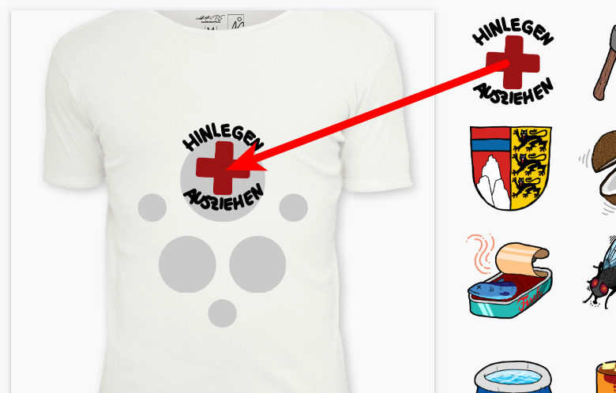

# Order process

Welcome to the Wolpertinger shirt service!

### 1. Getting a token

Contact one of the administrators of the running wolpertinger instance to get a token, which is only valid for one order.

### 2. Creating your shirt

The images you see on the right can be dragged onto the grey circles on the shirt to create the desired configuration. See here:

Once the shirt is fully configured with images, you can order the shirt with your name and the token you were given.

You will get a success message, that the shirt has successfully been ordered.

### 3. Something went wrong

If you get an error message, it's probably because someone else before you ordered the same or a similar configuration of your shirt.

Unfortunately, you have to switch out one or more images on your shirt. Just keep trying!

<b>Good Luck!</b>