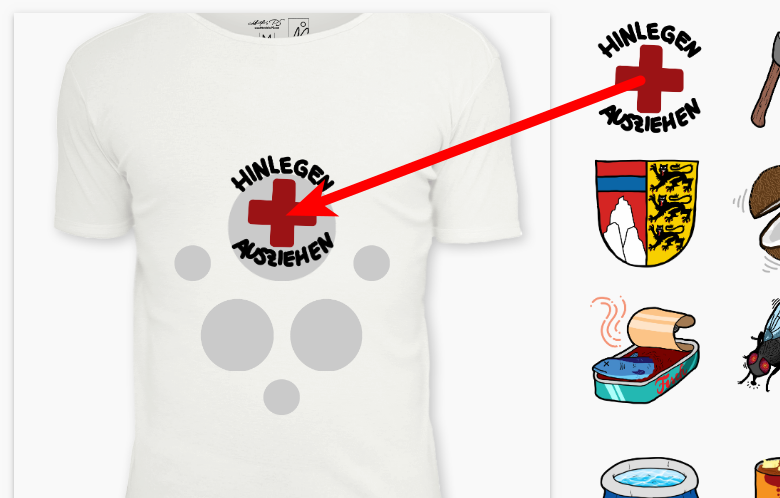

# Bestellvorgang

Willkommen beim Wolpertinger Shirtservice!

### 1. Ein Token bekommen

Wende dich an einen der Administratoren der laufenden Wolpertinger-Installation, um ein [Token](https://de.wikipedia.org/wiki/Universally_Unique_Identifier) zu erhalten, welches nur für eine Bestellung gültig ist.

### 2. Gestalte dein Shirt

Die Bilder, die man rechts sieht, können auf die grauen Kreise auf dem Shirt gezogen werden, um die gewünschte Konfiguration zu erhalten. Siehe hier:

Sobald das Shirt vollständig ausgefüllt ist (alle grauen Kreise besetzt mit Bildern), kannst du das Shirt mit deinem Namen und dem dir übergebenen Token bestellen.

Es erscheint eine Erfolgsmeldung, dass das Shirt erfolgreich bestellt wurde.

### 3. Fehler

Wenn eine Fehlermeldung erscheint, liegt das wahrscheinlich daran, dass jemand anderes die gleiche oder eine ähnliche Konfiguration des Shirts bestellt hat.

Leider müssen dann eins oder mehrere Bilder auf dem Shirt ausgetauscht werden. Versuche es einfach weiter!

<b>Viel Glück!</b>
